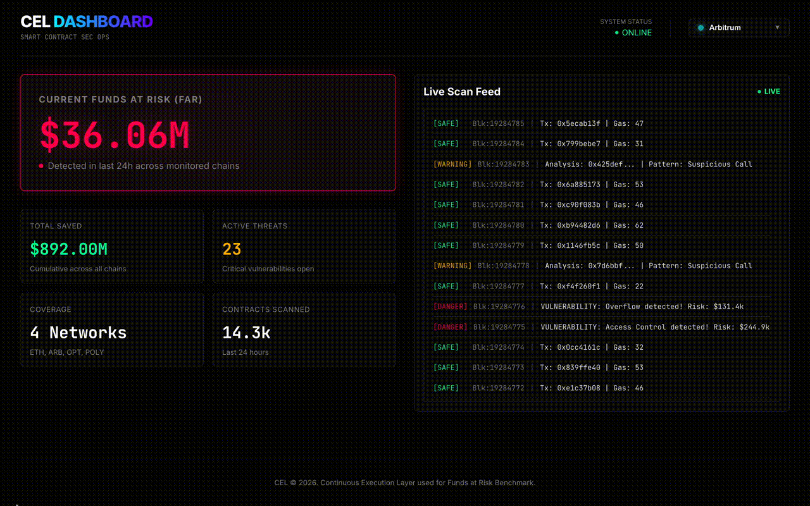

# CEL (Continuous Execution Layer) – Smart Contracts Cybersecurity
## FAR Benchmark / Dashboard (Funds at Risk) – Blockchain Networks

---
### 🎥 CEL / FAR Demo

---

### 🛡️ The Mission
**CEL** is a next-generation security infrastructure designed to transform blockchain security from periodic audits into a **continuous, autonomous, and strategic execution layer**. By leveraging cybersecurity-specialized AI agents, CEL protects smart contracts and on-chain capital at machine speed.

The core idea is simple:
> If AI can exploit smart contracts autonomously, **only AI can defend them at the same velocity**.

---

### 📊 Research Context: The $4.6M Proof-of-Concept (Anthropic)
Recent research by **Anthropic** demonstrates that AI agents have crossed a critical threshold in offensive blockchain security.

🔗 **Reference:** [AI agents find $4.6M in blockchain smart contract exploits](https://red.anthropic.com/2025/smart-contracts/)

Key findings:

- **$4.6M Identified Value:** Frontier models discovered exploitable vulnerabilities worth $4.6M in contracts deployed *after* their training cutoffs.
- **Zero‑Day Reality:** Agents uncovered novel zero-day vulnerabilities across **2,849 recently deployed contracts**.
- **Autonomous Feasibility:** Fully autonomous, profit-seeking exploit discovery is **technically viable today**.
- **Velocity Problem:** AI-driven exploit revenue is **doubling every ~1.3 months**, collapsing the time window between deployment and exploitation.

**Conclusion:**
> Reactive security and one-time audits are structurally incapable of keeping up.

---

### 🚀 A New Chapter in AI Security: CAI PRO & alias2
Most security vendors sell **assessments** — static, point-in-time reports.

**CAI (Cybersecurity AI)** builds **security itself**:
- In-house
- Continuous
- Executable

This project draws heavily from the *Cybersecurity Superintelligence* paradigm:

🔗 **Paper:** [A new chapter in AI security is about to begin](https://arxiv.org/pdf/2601.14614)

Using **CAI PRO** and the **alias2** model family, this approach introduces a fundamentally different security posture:

- **Superhuman Speed:** AI agents execute specific security tasks up to **3,600× faster** than human experts.
- **Economic Efficiency:** Operational costs reduced by **156×** compared to human-driven processes.
- **Strategic Capability:** **alias2** solves **76% of complex cybersecurity challenges**, outperforming GPT‑5 (~33%).
- **Game‑Theoretic Reasoning:** Via **G‑CTR (Generative Cut‑the‑Rope)**, agents compute **Nash‑equilibrium attack/defense strategies**, doubling success rates and reducing behavioral variance by **5.2×**.

> Most security tools *observe* risk. CAI agents *play the game*.

---

### 💡 What We Built: CEL & FAR

This repository represents the synthesis of:
- **Anthropic’s economic exploit research** (AI as an attacker)
- **CAI / alias2 architecture** (AI as a strategic defender)

#### 1️⃣ CEL – Continuous Execution Layer
**CEL** is a non-stop, autonomous security execution pipeline.

While Anthropic showed that a single AI audit run costs ~$1.22 per contract, CEL applies CAI’s multi-agent orchestration to make **24/7 monitoring economically viable**:

- **Token Cost Reduction:** ~98% efficiency gain
  - ~$5,940 → ~$119 per billion tokens
- **Always-On Defense:** Continuous scanning, simulation, and strategic response
- **Execution, Not Reporting:** Findings are directly actionable by machines

CEL turns smart contract security from a *workflow* into an *infrastructure layer*.

---

#### 2️⃣ FAR Dashboard – Funds at Risk
The **FAR Dashboard** exposes real-time systemic risk across blockchain networks.

Core capabilities:

- **Network Switching:** Multi-chain visibility (Ethereum, BNB, etc.)
- **Funds at Risk (FAR):** Dollar-value quantification of currently exploitable capital
- **Block-Level Precision:** Exact block numbers where vulnerabilities emerge
- **Real-Time Quanting:** Vulnerabilities priced directly in native tokens (ETH / BNB) using **SCONE-bench** methodologies
- **Attack Graphs:** G‑CTR-powered visualization of attack paths and defensive allocations

This converts abstract vulnerabilities into **economic and strategic signals**.

---

### ⚖️ Role Inversion: Humans & AI
CEL is built around a deliberate **role inversion**:

- **AI** → Strategic actor & executor
- **Human** → Supervisor & meta‑strategist

Humans define goals, constraints, and trust boundaries.
AI handles:
- Scale
- Speed
- Continuous adversarial reasoning

> AI is no longer optional — it is becoming **essential** for the survival of DeFi.

---

### 🧭 Project Vision
CEL is not another security product.

It is an attempt to define:
- What **continuous security** looks like in Web3
- How **AI-native defense** competes with AI-native attackers
- How capital protection becomes a **real-time systems problem**, not a compliance task

---

*Developed by **Michael Shapkin***  
*Inspired by the work of Winnie Xiao, Cole Killian, and the Alias Robotics research team.*

